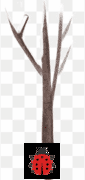

# Bug Animation

### Course: CS-124

### Name: Po-Ying Fu

### Describe assignment:

Take the code you wrote for ch9 animation ([animation.tgz](https://ohlone.instructure.com/courses/15812/files/2545332?module_item_id=668468)) and use the Animate and Picture class to create an animated gif of the bug going up and down the pole (You can use the previous CodeCheck exercise if you would like and you can use [bug.cpp](https://ohlone.instructure.com/courses/15812/files/2545331?module_item_id=668469) as a starting point). You need to upload a bug image (not a dog image). (Probably smaller is better e.g. 50x50).

You can use the code in the textbook.

Document the lab using pdftex so that you write a paragraph describing the lab, an image of the bug, the source code for the code you wrote in the pdf file. 

Create a tgz file that has all files in it including the animated gif file.

Upload those 2 files to Canvas  (pdf and tgz)

### GIF result:

### Source Code:
