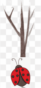

# Bug Animation

### Course: CS-124

### Name: Po-Ying Fu

### Describe assignment:

Take the code you wrote for ch9 animation ([animation.tgz](https://ohlone.instructure.com/courses/15812/files/2545332?module_item_id=668468)) and use the Animate and Picture class to create an animated gif of the bug going up and down the pole (You can use the previous CodeCheck exercise if you would like and you can use [bug.cpp](https://ohlone.instructure.com/courses/15812/files/2545331?module_item_id=668469) as a starting point). You need to upload a bug image (not a dog image). (Probably smaller is better e.g. 50x50).

You can use the code in the textbook.

Document the lab using pdftex so that you write a paragraph describing the lab, an image of the bug, the source code for the code you wrote in the pdf file. 

Create a tgz file that has all files in it including the animated gif file.

Upload those 2 files to Canvas  (pdf and tgz)

### GIF result:



### How to resize and make transparency image?

1. Download bug.jpg online

2. Resize and transform JPG to PNG:

```
 $ convert -resize 5% bug.jpg smallBug.png
```

3. Make image transparency:

```
convert smallBug.png -fuzz 10% -transparent white smallBug_transparency.png
```

> Note: Because background is not exactl white, so using `fuzz 10%` to convert almost-white color to transparent color.

### Source Code:

[demoBug.cpp](https://github.com/AmberFu/CS124_DataStructure_usingCpp/blob/main/Assignments/Lab1_BugAnimation/demoBug.cpp)

```cpp
#include "animation.h"
#include <iostream>

class Bug
{
public:
   Bug(Picture&, Picture&);
   int get_yposition() const;
   int get_xposition() const;
   int get_poleHeight();
   int get_bottom() const;
   bool isUp();
   void up();
   void down();
private:
   Picture bugPic;
   Picture polePic;
   int bottom;
   int y_position;
   int x_position;
   bool climbUp;
};

Bug::Bug(Picture& bug, Picture& pole)
{
   bugPic = bug;
   polePic = pole;
   bottom = pole.height() - bug.height();
   y_position = bottom;
   x_position = (pole.width()/2) - (bug.width()/2);
   climbUp = true;
}

int Bug::get_yposition() const
{
   return y_position;
}

int Bug::get_xposition() const
{
   return x_position;
}

int Bug::get_bottom() const
{
   return bottom;
}

bool Bug::isUp()
{
   return climbUp;
}

/* Climb UP first: up == true && y posi != poleHeight */
void Bug::up()
{
   if (y_position == 0){
      climbUp = false;
   }else{
      y_position -= 1;
   }
}

/* After climb to the top, climb down to the bottum position */
void Bug::down()
{
   if (y_position != get_bottom()){
           y_position += 1;
   }
}

/* Main: */
int main()
{
   Picture picBug("smallBug_transparency.png"); // Bug which going up and down.
   Picture picPole("halfTreePole.png"); // Background picture: a pole. 
   Bug smallbug(picBug, picPole);
   /* Using tree pole png create this GIF's background */
   Animation anim("animation.gif", picPole.width(), picPole.height());
   while(smallbug.isUp() == true){
      smallbug.up();
      anim.add(picPole, 0, 0);
      anim.add(picBug, smallbug.get_xposition(), smallbug.get_yposition());
      anim.frame();
   }
   while(smallbug.isUp() == false && 
         smallbug.get_yposition() != smallbug.get_bottom()){
      smallbug.down();
      anim.add(picPole, 0, 0);
      anim.add(picBug, smallbug.get_xposition(), smallbug.get_yposition());
      anim.frame();
   }
   anim.close();
}

```
